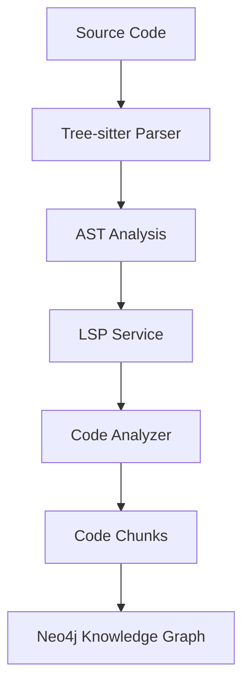

# Source Atlas

[](https://opensource.org/licenses/MIT)
[](https://www.python.org/downloads/)
[](https://deepwiki.com/quyen-ngv/source-atlas)

**Source Atlas** is a powerful multi-language code analyzer that combines Tree-sitter parsing, Language Server Protocol (LSP) integration, and Neo4j graph database to create comprehensive code knowledge graphs.

## ✨ Features

- 🌍 **Multi-Language Support**: Analyze Java, Python, Go, and TypeScript codebases
- 🔍 **Deep Code Analysis**: Extract classes, methods, dependencies, and relationships
- 🧠 **LSP Integration**: Leverage Language Server Protocol for semantic analysis
- 📊 **Knowledge Graph**: Build rich code graphs in Neo4j for advanced querying
- 🎯 **AST-Based**: Uses Tree-sitter for accurate syntax parsing
- ⚡ **Incremental Analysis**: Track code changes with AST hashing
- 🔗 **Relationship Tracking**: Discover implements, extends, uses, and calls relationships

## 🏗️ Architecture



**Components**:
- **Analyzers**: Language-specific code analyzers (Java, Python, Go, TypeScript)
- **Extractors**: Extract specific code elements (classes, methods, endpoints)
- **LSP Service**: Integrates with language servers for semantic information
- **Neo4j Service**: Manages code graph database operations
- **Models**: Domain models for code chunks, methods, and relationships

## 📋 Prerequisites

- **Python**: 3.8 or higher
- **Neo4j**: 5.x running locally or remotely
- **Language-specific tools** (for the languages you want to analyze):
  - Java: JDK 11+ (for LSP server)
  - Python: Python 3.8+
  - Go: Go 1.16+
  - TypeScript: Node.js 14+

## 🚀 Installation

### 1. Clone the repository

```bash
git clone https://github.com/quyen-ngv/source-atlas.git
cd source-atlas
```

### 2. Create virtual environment

```bash
python -m venv .venv
# Windows
.venv\Scripts\activate
# Linux/Mac
source .venv/bin/activate
```

### 3. Install dependencies

```bash
pip install -r requirements.txt
```

### 4. Set up Neo4j

Download and install [Neo4j Desktop](https://neo4j.com/download/) or use Docker:

```bash
docker run -d \
  --name neo4j \
  -p 7474:7474 -p 7687:7687 \
  -e NEO4J_AUTH=neo4j/your_password \
  neo4j:5.14.0
```

### 5. Configure environment

Create a `.env` file from the template:

```bash
cp .env.example .env
```

Edit `.env` with your settings:

```env
APP_NEO4J_URL=bolt://localhost:7687
APP_NEO4J_USER=neo4j
APP_NEO4J_PASSWORD=your_password
APP_NEO4J_DATABASE=neo4j
```

## 💻 Quick Start

### Basic Usage

```bash
python -m source_atlas analyze \
  --project-path /path/to/your/project \
  --language java \
  --project-id my-project \
  --output ./output
```

### Using as a Library

```python
from pathlib import Path
from analyzers.analyzer_factory import AnalyzerFactory
from neo4jdb.neo4j_service import Neo4jService

# Create analyzer
analyzer = AnalyzerFactory.create_analyzer(
    language="java",
    root_path="/path/to/project",
    project_id="my-project",
    branch="main"
)

# Analyze project
with analyzer:
    chunks = analyzer.parse_project(Path("/path/to/project"))

# Import to Neo4j
neo4j_service = Neo4jService(
    url="bolt://localhost:7687",
    user="neo4j",
    password="your_password"
)
neo4j_service.neo4j_service.import_code_chunks(
                chunks=chunks,
                batch_size=500,
                main_branch='main',
                base_branch='main',
                pull_request_id=None
            )
```

## 🔧 Configuration

### Environment Variables

| Variable | Description | Default | Required |
|----------|-------------|---------|----------|
| `APP_NEO4J_URL` | Neo4j connection URL | `bolt://localhost:7687` | Yes |
| `APP_NEO4J_USER` | Neo4j username | `neo4j` | Yes |
| `APP_NEO4J_PASSWORD` | Neo4j password | - | Yes |
| `APP_NEO4J_DATABASE` | Neo4j database name | `neo4j` | Yes |
| `NEO4J_MAX_CONNECTION_POOL_SIZE` | Max connection pool size | `50` | No |
| `NEO4J_CONNECTION_TIMEOUT` | Connection timeout (seconds) | `30.0` | No |

See [docs/configuration.md](docs/configuration.md) for detailed configuration options.

## 📚 Documentation

- [Architecture Overview](docs/architecture.md) - System design and components
- [Configuration Guide](docs/configuration.md) - All configuration options
- [Contributing Guidelines](CONTRIBUTING.md) - How to contribute
- [Security Policy](SECURITY.md) - Security and vulnerability reporting

## 🎯 Examples

### Analyze a Java Project

```bash
python -m source_atlas analyze \
  --project-path ./examples/java_project \
  --language java \
  --project-id example-java \
  --branch main
```

### Query the Knowledge Graph

```cypher
// Find all classes in a package
MATCH (c:Class {package: "com.example.service"})
RETURN c.className, c.filePath

// Find method call relationships
MATCH (m1:Method)-[:CALLS]->(m2:Method)
RETURN m1.name, m2.name

// Find implementation hierarchies
MATCH (c:Class)-[:IMPLEMENTS]->(i:Class)
RETURN c.fullClassName, i.fullClassName
```

## 🗂️ Project Structure

```
source_atlas/
├── analyzers/          # Language-specific code analyzers
│   ├── base_analyzer.py
│   ├── java_analyzer.py
│   └── analyzer_factory.py
├── extractors/         # Code element extractors
│   ├── java/
│   ├── python/
│   ├── go/
│   └── typescript/
├── lsp/               # LSP service integration
│   ├── lsp_service.py
│   └── implements/
├── models/            # Domain models
│   └── domain_models.py
├── neo4jdb/           # Neo4j integration
│   ├── neo4j_service.py
│   └── neo4j_dto.py
├── utils/             # Utility functions
└── config/            # Configuration
```

## 🤝 Contributing

We welcome contributions! Please see our [Contributing Guidelines](CONTRIBUTING.md) for details.

1. Fork the repository
2. Create a feature branch (`git checkout -b feature/amazing-feature`)
3. Commit your changes (`git commit -m 'Add amazing feature'`)
4. Push to the branch (`git push origin feature/amazing-feature`)
5. Open a Pull Request

## 📝 License

This project is licensed under the MIT License - see the [LICENSE](LICENSE) file for details.

## 🙏 Acknowledgments

- [Tree-sitter](https://tree-sitter.github.io/) - Incremental parsing system
- [Neo4j](https://neo4j.com/) - Graph database platform
- [LSP](https://microsoft.github.io/language-server-protocol/) - Language Server Protocol

## 📧 Contact

- **Author**: Nguyen Van Quyen
- **Email**: quyennv.4work@gmail.com
- **GitHub**: [@quyen-ngv](https://github.com/quyen-ngv)

## 🐛 Issues & Support

If you encounter any issues or have questions:
- Check our [documentation](docs/)
- Search [existing issues](https://github.com/quyen-ngv/source-atlas/issues)
- Create a [new issue](https://github.com/quyen-ngv/source-atlas/issues/new)

---

Made with ❤️ by [Nguyen Van Quyen](https://github.com/quyen-ngv)
