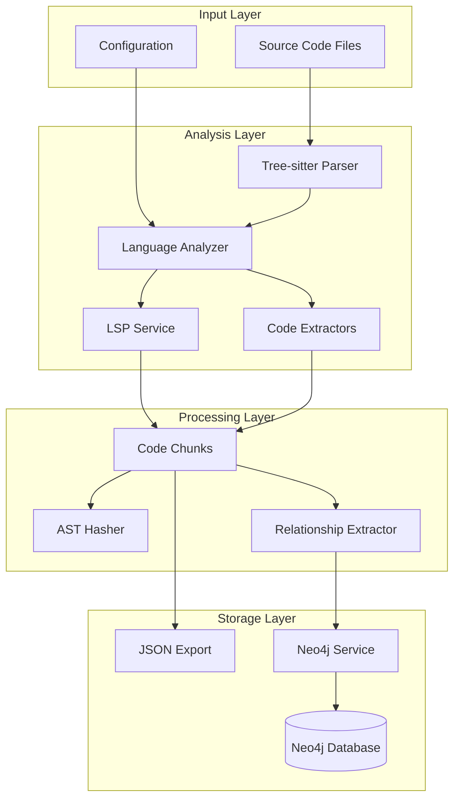
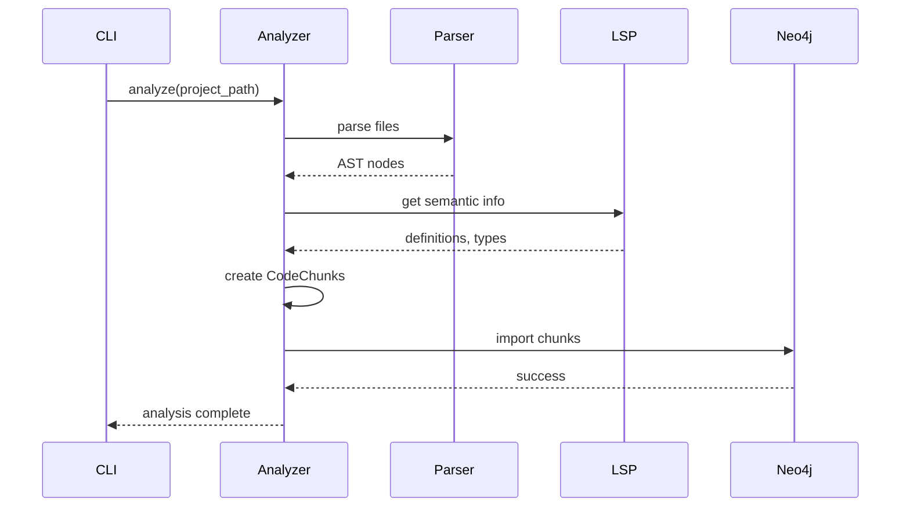

# Source Atlas Architecture

## Overview

Source Atlas is a multi-language code analysis tool that combines static analysis with semantic understanding to build rich code knowledge graphs. The system uses Tree-sitter for parsing, LSP for semantic information, and Neo4j for graph storage.

## System Architecture



## Core Components

### 1. Analyzers (`analyzers/`)

**Purpose**: Language-specific code analysis orchestration

**Key Classes**:
- `BaseCodeAnalyzer`: Abstract base class for all analyzers
- `JavaCodeAnalyzer`: Java-specific implementation
- `AnalyzerFactory`: Factory for creating language-specific analyzers

**Workflow**:
1. Scan project for source files
2. Build source cache for cross-references
3. Parse each file with Tree-sitter
4. Extract class nodes from AST
5. Query LSP for semantic information
6. Create CodeChunk instances
7. Export to JSON and/or Neo4j

### 2. Extractors (`extractors/`)

**Purpose**: Extract specific code elements from AST nodes

**Structure**:
```
extractors/
├── base_extractor.py
├── java/
│   ├── class_extractor.py
│   ├── method_extractor.py
│   ├── annotation_extractor.py
│   └── endpoint_extractor.py
├── python/
├── go/
└── typescript/
```

**Capabilities**:
- Extract class declarations
- Extract method signatures and bodies
- Extract annotations/decorators
- Extract REST endpoints
- Extract field access patterns
- Extract method calls

### 3. LSP Service (`lsp/`)

**Purpose**: Interface with Language Server Protocol servers

**Key Components**:
- `LSPService`: Base LSP service interface
- `multilspy/`: Third-party LSP integration library

**Features**:
- Start/stop LSP servers
- File synchronization
- Go-to-definition queries
- Type hierarchy queries
- Context management

**Example Usage**:
```python
with lsp_service.open_file(file_path):
    # LSP server has file context
    definition = lsp_service.get_definition(line, column)
```

### 4. Models (`models/`)

**Purpose**: Domain models for code representation

**Key Models**:

```python
@dataclass
class CodeChunk:
    package: str
    class_name: str
    full_class_name: str
    file_path: str
    content: str
    ast_hash: str
    implements: Tuple[str, ...]
    methods: List[Method]
    used_types: Tuple[str, ...]
    
@dataclass
class Method:
    name: str
    body: str
    ast_hash: str
    method_calls: Tuple[MethodCall, ...]
    used_types: Tuple[str, ...]
    field_access: Tuple[str, ...]
    inheritance_info: Tuple[str, ...]
```

### 5. Neo4j Service (`neo4jdb/`)

**Purpose**: Graph database operations

**Key Components**:
- `Neo4jService`: Main service class
- `Neo4jDTO`: Data transfer objects
- `neo4j_db.py`: Low-level database operations

**Features**:
- Batch import of code chunks
- Relationship creation
- Query optimizations
- Transaction management

**Graph Schema**:
```cypher
// Nodes
(:Class {fullClassName, package, className, filePath, astHash})
(:Method {name, astHash, body})

// Relationships
(:Class)-[:IMPLEMENTS]->(:Class)
(:Class)-[:EXTENDS]->(:Class)
(:Class)-[:USES]->(:Class)
(:Method)-[:CALLS]->(:Method)
(:Method)-[:ACCESSES_FIELD]->(:Field)
```

## Data Flow

### Analysis Pipeline



### Code Chunk Creation

1. **File Reading**: Read source file content
2. **Comment Removal**: Strip comments for cleaner AST
3. **Parsing**: Parse with Tree-sitter to get AST
4. **Class Extraction**: Find class/interface nodes
5. **Context Building**: Build import mappings and class context
6. **Method Extraction**: Extract all methods from class
7. **LSP Queries**: Query LSP for implements/extends
8. **Type Analysis**: Analyze used types
9. **Hashing**: Compute AST hash for change detection
10. **Chunk Creation**: Create CodeChunk instance

## Optimization Strategies

### 1. Caching

**Source Cache**: Pre-scan all files to build class name mappings
```python
cached_nodes: Dict[str, ClassParsingContext] = {}
```

**Method Cache**: Cache method names for call resolution
```python
methods_cache: Set[str] = set()
```

### 2. Lazy Evaluation

Only compute expensive operations when needed:
```python
if self._should_check_implements(class_node):
    implements = self._extract_implements_with_lsp()
```

### 3. Batch Processing

Neo4j imports use batching for efficiency:
```python
neo4j_service.import_code_chunks(chunks, batch_size=500)
```

### 4. Context Management

LSP file contexts are managed with context managers:
```python
with lsp_service.open_file(file_path):
    # File is open in LSP
    ...
# File automatically closed
```

## Configuration Management

### Environment-Based Config

Uses `pydantic-settings` for configuration:
```python
class Configs(BaseSettings):
    APP_NEO4J_URL: str = os.getenv("APP_NEO4J_URL")
    APP_NEO4J_PASSWORD: str = os.getenv("APP_NEO4J_PASSWORD")
```

### Validation

Configuration validation ensures required settings:
```python
configs.validate_neo4j_config()
```

## Error Handling

### Graceful Degradation

- Continue processing if single file fails
- Log errors without stopping entire analysis
- Collect errors for final reporting

### LSP Error Handling

- Retry connection failures
- Fallback to AST-only analysis if LSP unavailable
- Timeout protection for long-running queries

## Extensibility

### Adding New Languages

1. Create language-specific analyzer extending `BaseCodeAnalyzer`
2. Implement abstract methods for language syntax
3. Create extractors in `extractors/<language>/`
4. Add LSP implementation if needed
5. Update `AnalyzerFactory`

Example:
```python
class PythonCodeAnalyzer(BaseCodeAnalyzer):
    def _extract_class_nodes(self, root_node):
        # Python-specific implementation
        ...
```

### Adding New Extractors

1. Extend `BaseExtractor`
2. Implement extraction logic
3. Register in language analyzer

## Performance Characteristics

| Operation | Complexity | Notes |
|-----------|-----------|-------|
| File parsing | O(n) | Linear in file size |
| Class extraction | O(m) | Linear in number of classes |
| LSP queries | O(1) | Per query, but I/O bound |
| Neo4j import | O(k) | Linear in chunks, batched |
| Overall | O(n + m) | n = files, m = classes |

## Security Considerations

1. **Code Execution**: No code execution, only parsing
2. **LSP Servers**: Use trusted LSP implementations
3. **Database**: Validate Neo4j credentials
4. **Input Validation**: Validate file paths and languages

## Future Enhancements

- [ ] Parallel file processing (with LSP threading support)
- [ ] Incremental analysis (analyze only changed files)
- [ ] Plugin system for custom extractors
- [ ] Multi-project analysis
- [ ] Visualization dashboard
- [ ] Code metrics and quality analysis
- [ ] Dependency vulnerability scanning

## References

- [Tree-sitter Documentation](https://tree-sitter.github.io/)
- [LSP Specification](https://microsoft.github.io/language-server-protocol/)
- [Neo4j Documentation](https://neo4j.com/docs/)
